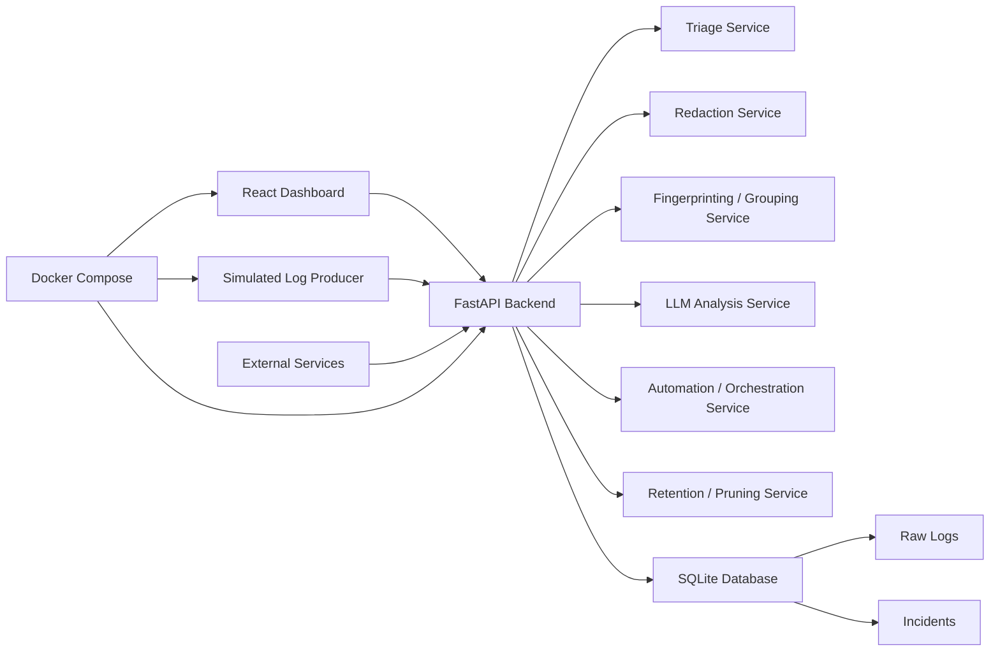

# Architecture

## High-Level Overview

The AI Ops Automation System is a full-stack demo platform for turning raw application logs into structured incidents. It supports both manual log analysis and automated log ingestion from multiple services.

At a high level:

- the React frontend provides dashboards for incidents, raw logs, analytics, and manual analysis
- the FastAPI backend exposes APIs for ingestion, analysis, triage, incident management, and maintenance
- SQLite stores both raw operational data and incident records
- rule-based services handle triage, redaction, fingerprinting, automation, and retention
- a simulated log producer can continuously send service logs for demos
- Docker Compose can run the full stack locally

## Architecture Diagram

## Core Components

### React Dashboard

The frontend is a Vite + React dashboard that shows:

- overview KPIs and charts
- incident history and incident details
- raw logs with filtering
- manual log analysis input

### FastAPI Backend

The backend is the main orchestration layer. It receives logs, stores data, runs triage, redacts sensitive content, performs incident analysis, applies automation rules, and exposes maintenance endpoints.

### SQLite Database

SQLite is used for local persistence in this portfolio project. It stores:

- services
- raw logs
- incidents

### Raw Log Ingestion APIs

The ingestion APIs allow services or scripts to send logs into the platform:

- `POST /api/logs/ingest`
- `POST /api/logs/batch`
- `GET /api/logs/raw`

These APIs store raw logs before or alongside any incident creation.

### Triage Service

The triage service evaluates each ingested log using rule-based logic and decides whether it should be:

- `analyze`
- `store_only`
- `ignore`

It also assigns a `risk_score` to help prioritize logs.

### Redaction Service

Before logs are sent to the LLM analysis service, sensitive values such as emails, bearer tokens, passwords, and authorization headers are redacted.

### Fingerprinting / Grouping Service

The fingerprinting service normalizes similar log messages and generates a stable hash. This is used to group repeated log events and avoid creating duplicate incidents for the same recurring issue.

### LLM Analysis Service

The analysis service supports:

- `mock` mode for deterministic rule-based analysis
- `openai` mode for structured LLM-based incident analysis

It returns structured incident fields such as severity, incident type, summary, root cause, and recommended actions.

### Automation / Orchestration Service

After analysis, automation rules assign:

- priority score
- escalation action
- escalation message

This creates a more operationally useful incident record.

### Retention / Pruning Service

The retention service deletes old raw logs without deleting incidents. This helps manage local storage growth over time.

### Simulated Log Producer

The log producer is a simple Python script that continuously sends realistic logs from multiple services into the ingestion API. It is useful for live demos and dashboard testing.

### Docker Compose Setup

Docker Compose runs the platform locally with:

- backend
- frontend
- optional simulated log producer

The producer is behind a `producer` profile so it is opt-in for demos.

## Data Flow

### Manual Log Analysis Flow

1. A user pastes or uploads logs in the React dashboard.
2. The frontend sends those logs to `POST /api/logs/analyze`.
3. The backend redacts sensitive data.
4. The redacted logs are analyzed by the mock or OpenAI LLM service.
5. Automation rules assign escalation and priority metadata.
6. The backend stores the incident in SQLite.
7. The dashboard refreshes and shows the new incident.

### Automated Ingestion Flow

1. A real service or the simulated log producer sends a log to the ingestion API.
2. The backend stores the raw log.
3. The triage service decides whether to analyze, store only, or ignore.
4. If the log is high risk:
   - sensitive data is redacted
   - the log is analyzed
   - automation metadata is applied
   - an incident is created or grouped into an existing open incident
5. The dashboard and raw log views refresh automatically and show the new state.

## Why These Design Choices

### Rule-Based Triage Before LLM

Rule-based triage reduces unnecessary LLM calls, lowers cost, and prevents low-value logs from being analyzed when they are clearly informational.

### Redaction Before LLM

Redaction protects secrets and personally identifiable information before logs leave the backend analysis boundary.

### Fingerprinting to Prevent Duplicate Incidents

Repeated failures often come from the same underlying issue. Fingerprinting makes it possible to group repeated logs into one open incident and track occurrence count instead of flooding the dashboard with duplicates.

### Retention Pruning for Storage Control

Raw logs can grow quickly. Retention pruning keeps the demo lightweight while preserving incident records for analysis and presentation.
